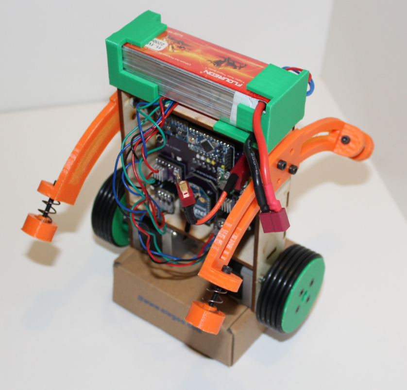

# SelfBalanceRobot

Self Balancing Robot Based on Joop Brokkings Model, Code, and BOM  

*CAD Model:* https://grabcad.com/library/self-balancing-robot-4  

His documentation is found here: http://www.brokking.net/yabr_main.html  

Joop's videos. These excellent videos taught me how to make this:  
Part 1:  https://www.youtube.com/watch?v=6WWqo-Yr8lA  
Part 2: https://www.youtube.com/watch?v=VxpMWncBKZc  
Part 3: https://www.youtube.com/watch?v=mG4OtAiY_wU  

I created a PCB for my own version of the project.  
My version uses an XBee in place of the bluetooth module,  
and the sparkfun wireless joystick instead of the nunchuck.  

*Joystick Code and Case:* https://github.com/richardFirth/WirelessJoystick  

Order PCB's in Model  
*Main PCB Board:* https://oshpark.com/shared_projects/zdu8sdQ4  
*Stepper Boards:* https://oshpark.com/shared_projects/qPz78o0H  
*Xbee Board:* https://oshpark.com/shared_projects/hA4cGipD  
(you need one of each to build the Robot)  

  
